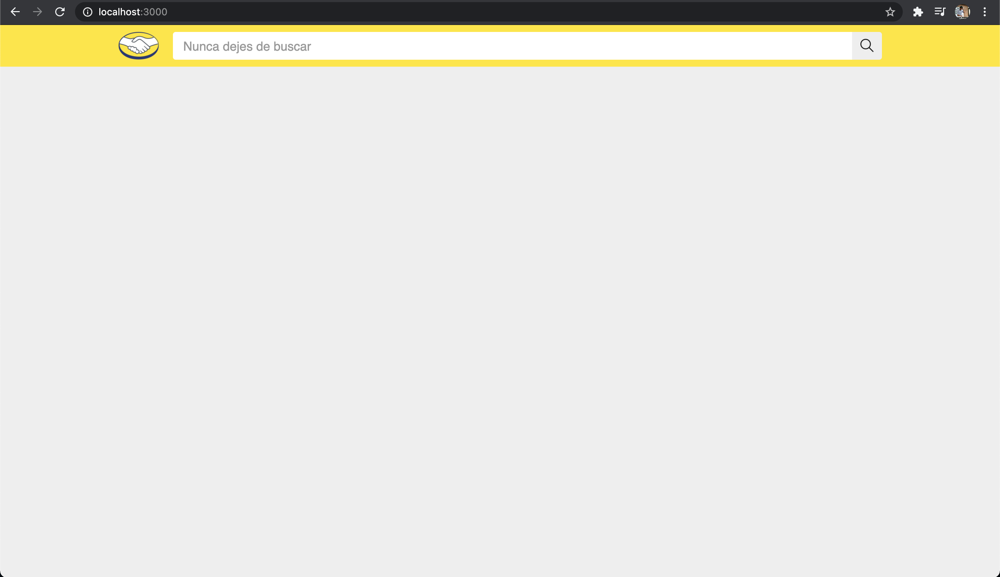
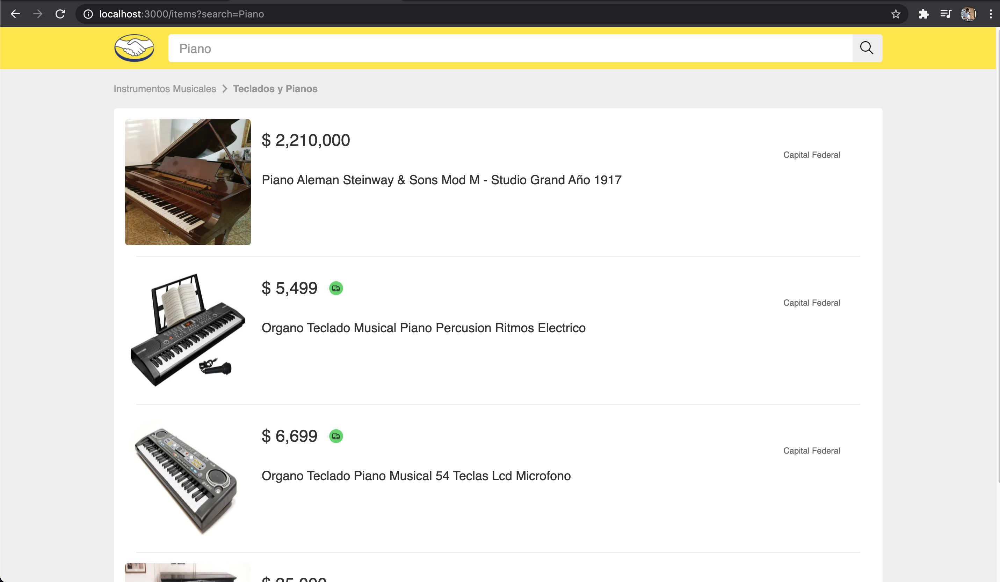
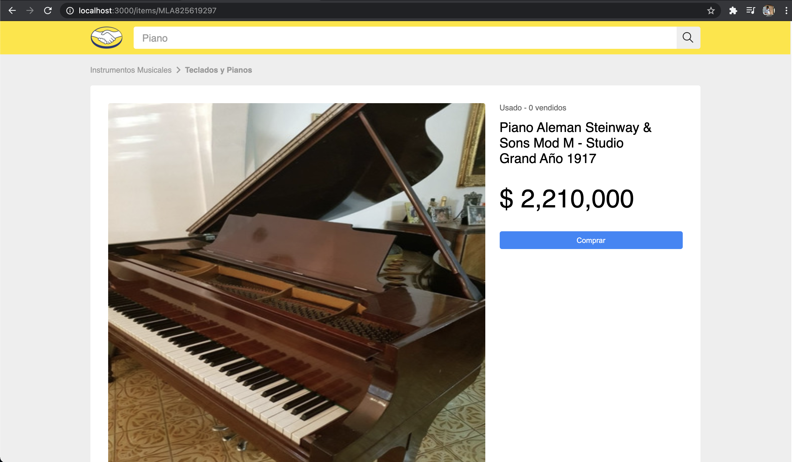
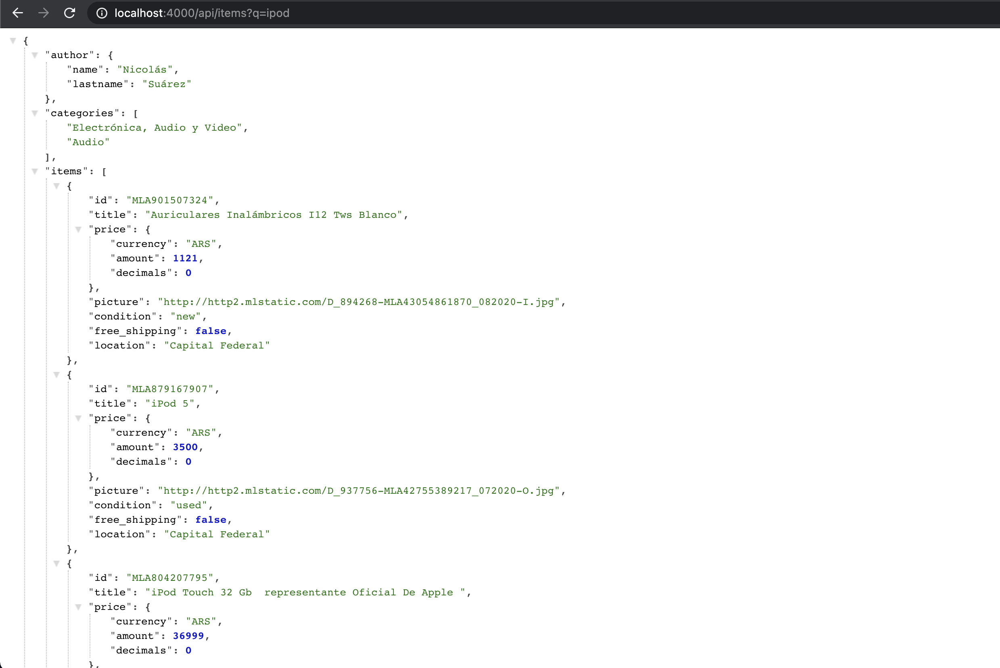
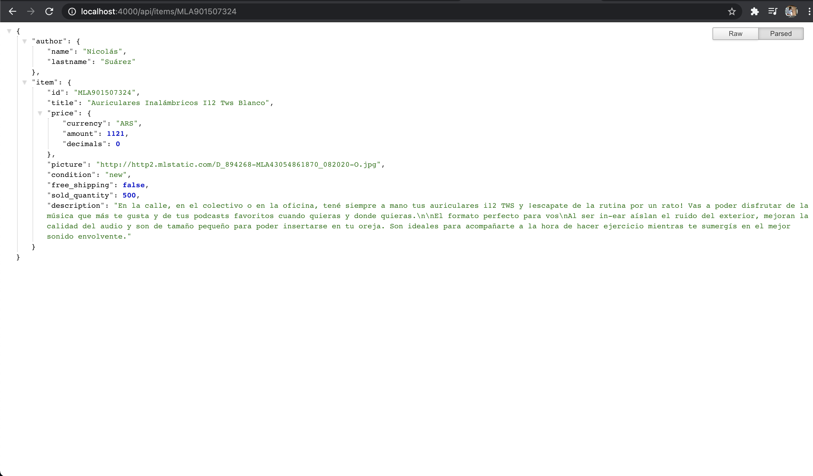

# Author
Nicolás Suárez Jiménez

## Frontend Client
This project was made using React js and Redux. The purpose was to replicate the designs given by ML to test different programming skills. 

To run the project use: `npm install` - `npm start`

### Screenshots:
##### Search Box

##### Search Result

##### Product Detail

## Frontend Server
This server was implemented using Node Js and Express Js to comunicate the frontend client with the api provided by ML.

To run the project use: `npm install` - `npm start`

### Screenshots:
Resource: `/api/items?q=ipod`

Resource: `/api/items/MLA825619297`
